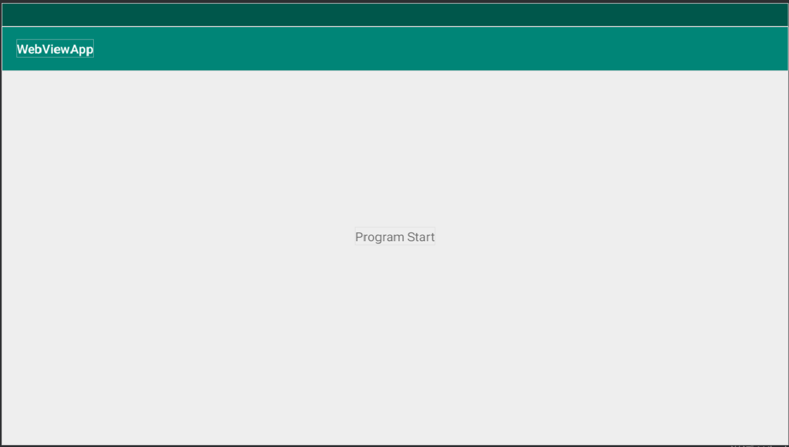

# Rapport


Uppgiften den här gången är att helt enkelt modifiera innehållet i texten och ändra koden i raden andriod:text.  Låt appen visa vad jag skriver.
```
<TextView
        android:layout_width="wrap_content"
        android:layout_height="wrap_content"
        android:text="Program Start"
        app:layout_constraintBottom_toBottomOf="parent"
        app:layout_constraintLeft_toLeftOf="parent"
        app:layout_constraintRight_toRightOf="parent"
        app:layout_constraintTop_toTopOf="parent" />
```



